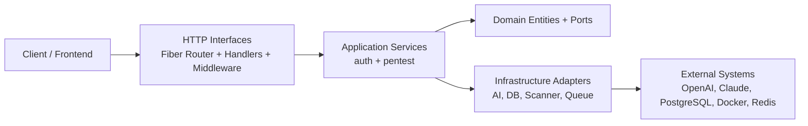
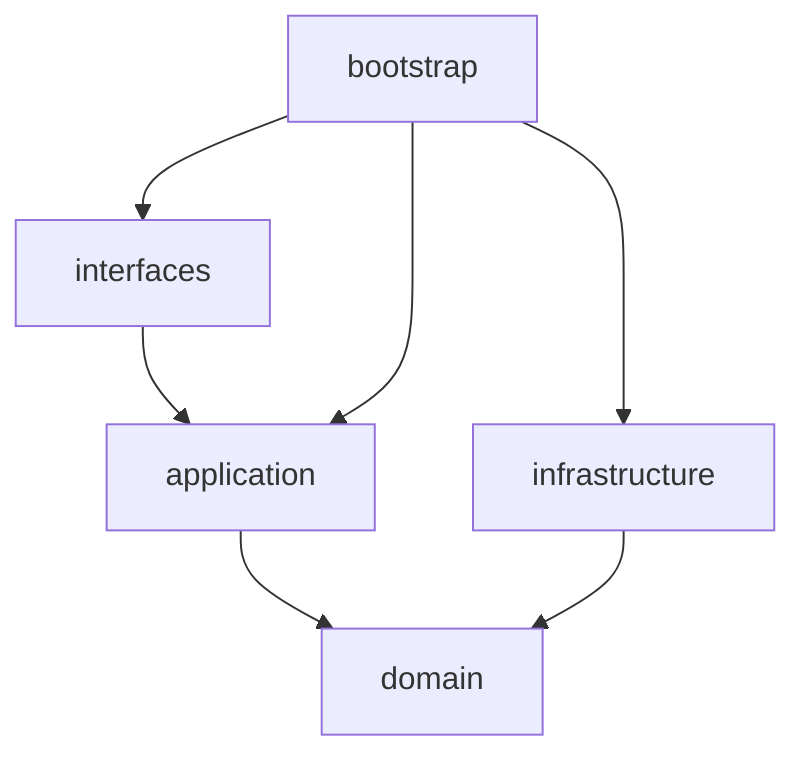
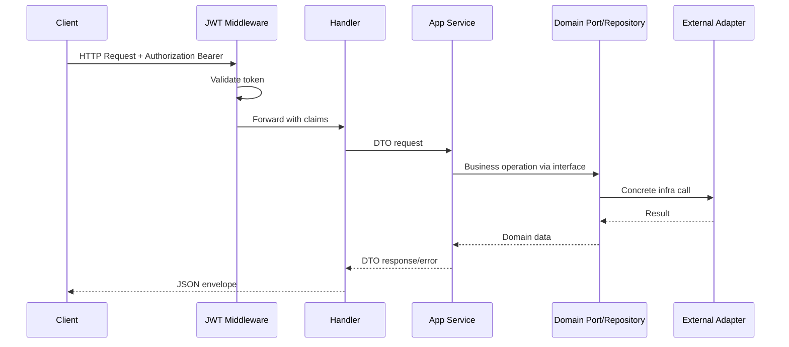

# APANT BE Architecture Documentation

## 1. Executive Summary

Project ini menggunakan pendekatan **Clean Architecture** dengan gaya **Ports and Adapters (Hexagonal)**.
Arah dependency utamanya adalah:

- interfaces -> application -> domain
- infrastructure mengimplementasikan port/kontrak domain
- bootstrap melakukan wiring semua dependency

Dengan pola ini, business logic tidak tergantung framework HTTP (Fiber), tidak tergantung provider AI spesifik, dan tidak tergantung storage spesifik.

## 2. High-Level Architecture

## 3. Folder Structure and Separation of Concerns

### 3.1 Root Level

- `cmd/`
  - Entry point aplikasi executable.
  - `cmd/api/main.go` memulai app dari config + bootstrap.

- `configs/`
  - Disiapkan untuk konfigurasi file-based (saat ini kosong).

- `internal/`
  - Source utama aplikasi dengan boundary per concern.

- `migrations/`
  - Legacy placeholder

- `scripts/`
  - Tempat script operasional/devops (saat ini kosong).

- `ARCHITECTURE.md`
  - Dokumentasi arsitektur ini.

- `readme.md`
  - Dokumentasi setup dan operasional project.

### 3.2 Internal Layer Breakdown

#### A. `internal/domain`

**Tujuan:** pusat model bisnis dan kontrak (port).

- `user.go`
  - Entity: `User`, `RefreshToken`, role constant.
- `scan.go`
  - Entity: `Scan`, `Session`, `Message`.
- `user_repository.go`
  - Port repository auth user/token.
- `scan_repository.go`
  - Port repository scan/session.
- `ports.go`
  - Port lintas concern: AI gateway, tool executor, policy, registry.

**Catatan:** domain tidak mengimpor Fiber/GORM/provider API. Ini menjaga business core tetap bersih.

#### B. `internal/application`

**Tujuan:** orchestration use case.

- `application/auth`
  - Validasi credential.
  - Register/login/refresh/logout flow.
  - JWT issue + refresh token rotation.

- `application/pentest`
  - Chat ke provider AI.
  - Agent planner loop (tool_intent vs final_answer).
  - Tool policy validation dan execution.
  - Session timeline management.

**Catatan:** application bergantung pada port domain, bukan implementasi concrete.

#### C. `internal/interfaces`

**Tujuan:** delivery mechanism (transport layer).

- `interfaces/http/router.go`
  - Routing endpoint publik dan protected endpoint.
- `interfaces/http/handler/*.go`
  - Parsing request, memanggil service, mapping error/response JSON.
- `interfaces/http/middleware/auth.go`
  - JWT bearer validation untuk route protected.
- `interfaces/worker/scan_worker.go`
  - Interface async worker untuk konsumsi payload queue.

**Catatan:** handler tipis, fokus pada I/O HTTP.

#### D. `internal/infrastructure`

**Tujuan:** adapter konkret ke external systems.

- `infrastructure/ai`
  - `openai.go`, `claude.go`: provider adapters.
  - `agent.go`: provider gateway multiplexer.
  - `types.go`: provider interface.

- `infrastructure/db`
  - `postgres.go`: koneksi GORM postgres.
  - `user_repository_postgres.go`: implementasi `UserRepository` via Postgres.
  - `user_repository_memory.go`: implementasi in-memory.
  - `session_repository_memory.go`: implementasi `SessionRepository` in-memory.
  - `scan_repository_postgres.go`: skeleton adapter scan (belum implemented).
  - `migrations.go`: definisi migration GORM via gormigrate.

- `infrastructure/scanner`
  - `policy.go`: whitelist + parameter validation tool intent.
  - `registry.go`: daftar tools available/planned.
  - `nmap.go`: eksekusi nmap via docker container + parse XML hasil.

- `infrastructure/queue`
  - `scan_job.go`: model payload async.
  - `redis.go`: stub client wrapper.

#### E. `internal/bootstrap`

**Tujuan:** composition root / dependency injection manual.

- `bootstrap/app.go`
  - Inisialisasi Fiber middleware.
  - Build provider AI + scanner + repositories.
  - Build service auth/pentest.
  - Registrasi router.
  - Storage fallback strategy (`postgres` -> memory bila gagal).

#### F. `internal/config`

**Tujuan:** load runtime config dari env.

- `config.go`
  - Mapping env -> struct `Config`.
  - Builder DSN postgres.

#### G. `internal/shared`

**Tujuan:** shared cross-cutting helpers.

- `shared/errors`
  - `AppError` + resolver status code.
- `shared/httpx`
  - Standard JSON success/error envelope.
- `shared/logger`
  - Wrapper logging sederhana.

## 4. Dependency Direction (Why It Is Clean)

Rules yang terlihat dari code:

- Domain tidak tahu implementation details.
- Application menerima dependency berupa interface/port.
- Infrastructure mengimplementasikan port yang dibutuhkan use case.
- Bootstrap jadi satu-satunya tempat wiring concrete dependency.

## 5. Business Processes

## 5.1 Authentication Process

### Register

1. Client kirim username/password.
2. Handler parse body dan panggil `auth.Service.Register`.
3. Service validasi format username/password.
4. Service cek user existing via `UserRepository`.
5. Password di-hash bcrypt.
6. User disimpan.
7. Access token JWT + refresh token dibuat.
8. Refresh token hash disimpan.
9. Response auth payload dikembalikan.

### Login

1. Client kirim credential.
2. Service fetch user by username.
3. Compare bcrypt hash.
4. Jika valid, issue token pair baru.

### Refresh Token

1. Client kirim refresh token raw.
2. Service hash token lalu lookup stored hash.
3. Validasi revoked/expired.
4. Revoke old refresh token (rotation).
5. Issue token pair baru.

### Logout

1. Middleware validasi JWT dan set claims.
2. Handler ambil `sub` user ID.
3. Service revoke semua refresh token user.
4. Optional: revoke token yang dikirim body bila cocok.

## 5.2 Pentest Agent Process

### Chat (direct LLM)

1. Request `provider + message` diterima.
2. Service validasi input.
3. `AIGateway.Generate` panggil provider adapter.
4. Provider result dipetakan ke response.

### Agent Chat (single step planner)

1. Normalisasi request + ensure session.
2. User message ditambahkan ke timeline session.
3. Planner prompt dibentuk dari history + message baru.
4. LLM wajib mengembalikan JSON terstruktur.
5. Jika `final_answer` -> langsung return jawaban.
6. Jika `tool_intent` -> policy validate -> simpan event -> return accepted intent.

### Agent Execute (manual tool execution)

1. Endpoint menerima `tool_intent`.
2. Policy validate.
3. Executor jalankan tool (saat ini nmap via docker).
4. Return `tool_result`.

### Agent Loop (planner + execute + finalizer)

1. Planner menghasilkan `tool_intent` atau `final_answer`.
2. Jika `tool_intent`, executor jalankan tool.
3. Hasil tool dikirim lagi ke LLM finalizer.
4. Finalizer harus return `final_answer` JSON.
5. Semua step disimpan ke session timeline.

## 6. Request -> Response Data Flow

## 6.1 Protected HTTP Request Flow

## 6.2 Public HTTP Request Flow

1. Router mengarahkan request ke handler endpoint.
2. Handler bind dan validasi format body minimal.
3. Handler panggil service application.
4. Service jalankan business rule dan koordinasi port.
5. Bila error, `shared/errors.Resolve` memetakan status code + message.
6. Handler return response konsisten melalui `shared/httpx`.

## 6.3 JSON Envelope Contract

- Success:
  - `{"success": true, "data": ...}`
- Error:
  - `{"success": false, "error": {"message": "..."}}`

## 7. Endpoint to Use Case Mapping

### Public Endpoints

- `GET /api/v1/health` -> health check.
- `GET /api/v1/providers` -> daftar provider AI.
- `POST /api/v1/auth/register` -> register user + token issuance.
- `POST /api/v1/auth/login` -> login + token issuance.
- `POST /api/v1/auth/refresh-token` -> token rotation.

### Protected Endpoints

- `POST /api/v1/auth/logout` -> revoke refresh tokens.
- `POST /api/v1/chat` -> one-shot LLM response.
- `POST /api/v1/agent/chat` -> planner mode (intent/final).
- `POST /api/v1/agent/execute` -> manual tool run.
- `POST /api/v1/agent/loop` -> planner + execute + finalizer.
- `GET /api/v1/tools` -> tool registry info.
- `POST /api/v1/sessions` -> create session.
- `GET /api/v1/sessions` -> list sessions.
- `GET /api/v1/sessions/:id` -> detail session timeline.

## 8. Current State and Known Gaps

- `ScanRepositoryPostgres` masih placeholder (not implemented).
- Session repository saat ini masih in-memory (belum persistent).
- Queue adapter Redis masih minimal/stub.
- Tool yang benar-benar dieksekusi baru `nmap_scan`.
- `sqlmap_scan` dan `nikto_scan` masih status planned di registry.

## 9. Why This Structure Is Maintainable

- Feature baru bisa ditambah di layer application tanpa rewrite adapter lama.
- Penggantian provider (AI/DB/queue) cukup di infrastructure + bootstrap wiring.
- Testing lebih mudah karena service bergantung interface (bisa mock).
- HTTP transport tidak mencampur detail business rule.

## 10. Recommended Next Evolution

1. Implement persistent `SessionRepository` (Postgres/Redis).
2. Implement `ScanRepositoryPostgres` untuk audit scan runs.
3. Tambah observability (request id, tracing, structured log).
4. Tambah unit/integration tests per service use case.
5. Tambah async pipeline nyata (enqueue + worker loop + retry policy).
